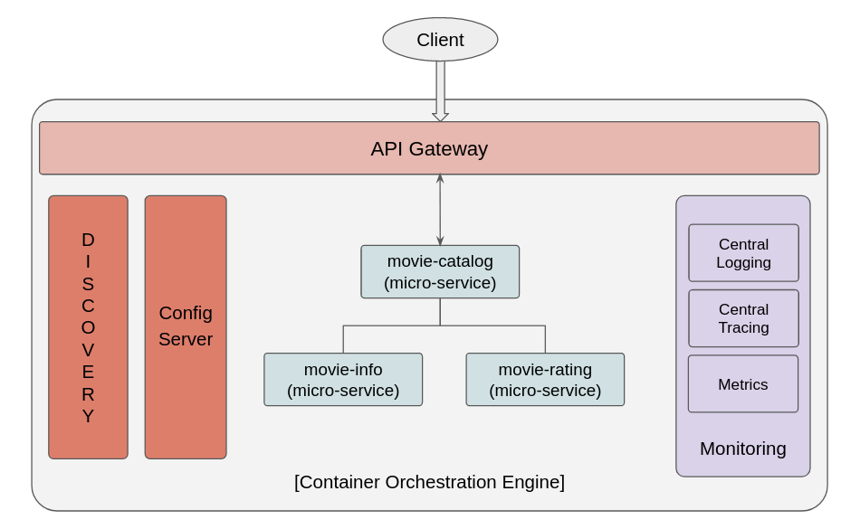

# Microservice World

Common components such as API Gateway, Discovery Server, Config-Server and sample movie-catalog application composed of 3 microservices are implemented with SpringBoot in this project.

## Components

### API Gateway
API gateway is the single entry point for all clients. The API gateway handles requests in one of two ways.
Some requests are simply proxied/routed to the appropriate service. It handles other requests by fanning out to multiple services.
The API gateway might also implement security, e.g. verify that the client is authorized to perform the request.

### Discovery Server
Spring Cloud Netflix Eureka allows services to communicate with each other without the need for hostname and port.
The only important point in this architecture is that every service is a service that must be registered.
List of all connected clients are recorded by With Netflix Eureka and requests are distributed to the services with the load balancing algorithm.

### Config Server
Each service implemented in this project has its own configurations. It's better to manage configurations with a common config-server. (There will be hundreds, maybe thousands of microservices in real-life scenarios.)
Config-Server component has the information required to read the configuration values. Configurations can be stored in a simple file in the filesystem, or file in a version control system. It's usually implemented with one or more files in Git repos.
I used github repo in this project as well.

### Movie-Catalog-Service
Sample microservice which will be called to get movie catalog. It will call 2 other services (info & rating) and build final data will be sent back to the client.

### Movie-Info-Service
Sample microservice which returns basic information of the movie such as id, name and year.

### Movie-Rating-Service
Sample microservice which returns movie rating and total number of the reviewers.

## References
https://github.com/selimgul/microservice-ecosystem

https://microservices.io/index.html
